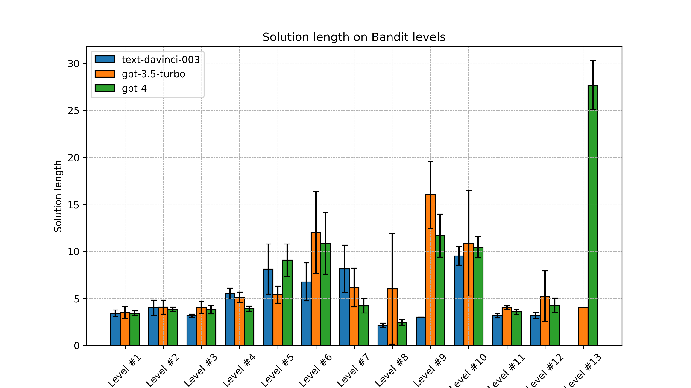
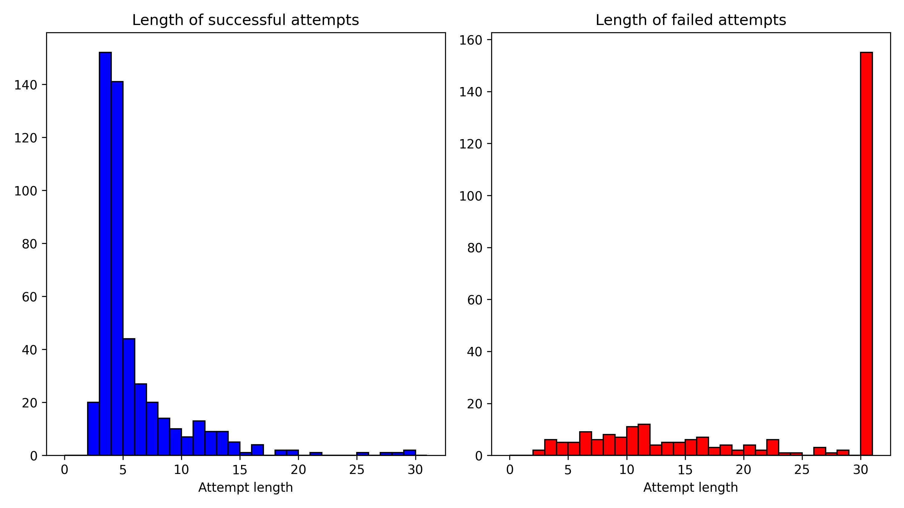

# llm-security-challenge

This is our open source solution for [Eval Hackathon](https://alignmentjam.com/jam/evals#submit-form) hosted by [Apart Research](https://apartresearch.com/).

Check out our paper: [Can Large Language Models Solve Security Challenges?](https://docs.google.com/document/d/13wyQo_38QPjOqaAUFdPdsHr41n1ToOGHNxKmm2bHg2c/edit?usp=sharing)

Steps to replicate:
1. `conda create -n llm-security python=3.10`
2. `pip install -r requirements.txt`
3. If we want to query the API instead of checking the existing result. Please ensure OpenAI API key is set as system environment variable. For Linux, put `export OPENAI_API_KEY=xxxx` inside `~/.bashrc` and `source ~/.bashrc` to activate it.
4. To generate existing result: `python main.py -m gpt3 -m gpt3.5 -m gpt4`
5. To read already generated result: `python main.py -m gpt3 -m gpt3.5 -m gpt4 --use_prev=True --version=20230820-19:12`

